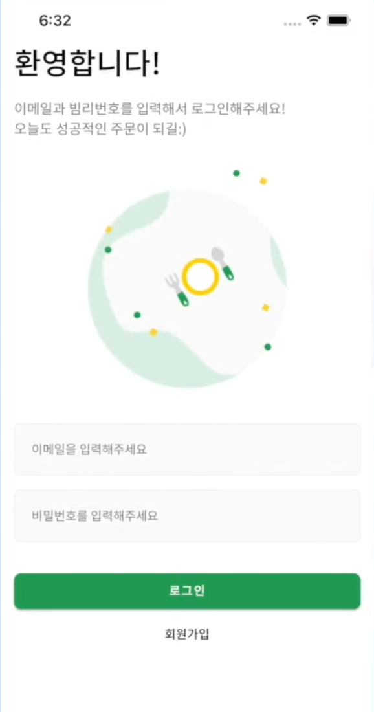
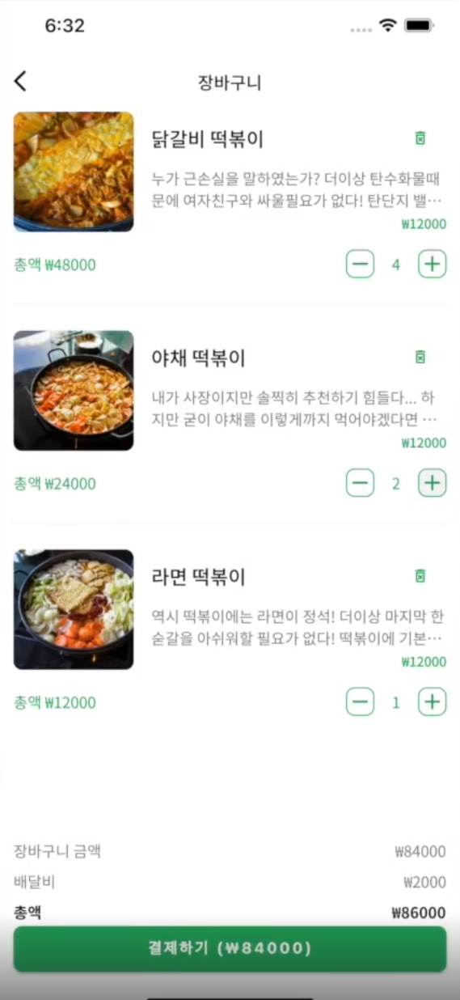
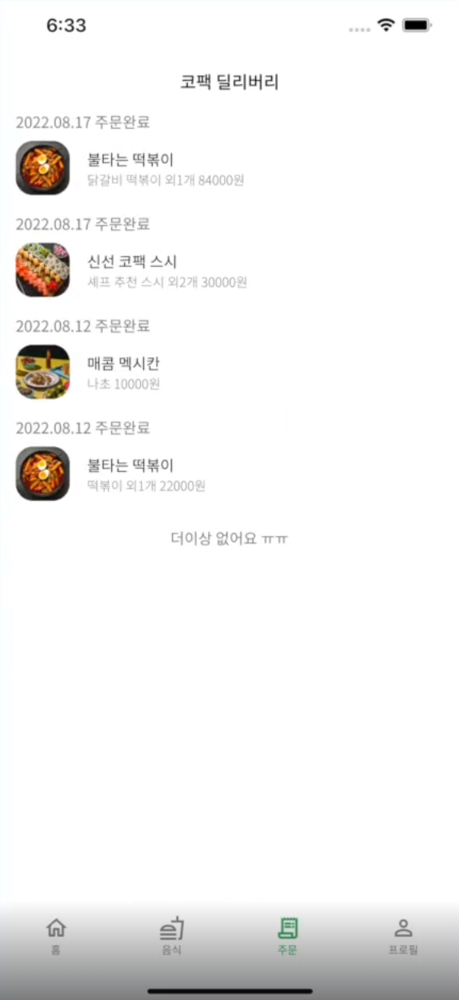

# 플러터로 제작한 배달앱 입니다.

 

## 프로젝트 목표

- [] Authentication 인증
    - RefreshToken과 AccessToken 작동 원리와 방식을 탄탄하게 익힘.
    - gRouter와 Dio을 이용해 자동으로 토큰을 검증하고, 토큰 신규 발급을 해서 라우팅하는 방법까지 학습

- [] Pagination
    - 가장 기본적인 형태로 페이지네이션을 먼저 구현해보고, 코드 최적화 및 일반화를 통해 유지보수가 굉장히 편한 코드 작성법 학습

- [] JsonSerializable / Retrofit / Code Generation
    - 효율적으로 모델을 작성하는 방법과 REST API요청을 정리하는 방법 학습

- [] Riverpod 글로벌 상태관리 캐시관리
    - 리버팟을 사용하면서 캐시관리 기술을 배움.

 

## 목표 구현도

